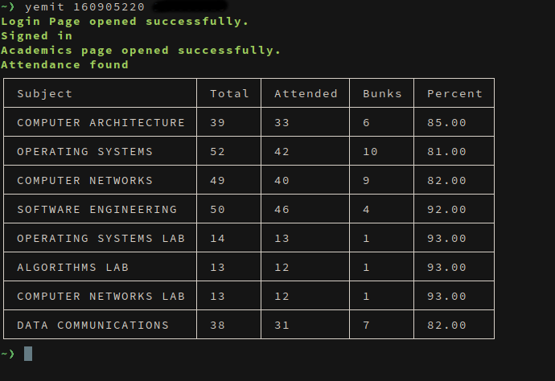

# _Yem-IT_
:tada: A npm package for MIT Manipal students that fetches attendance.

:heavy_exclamation_mark::heavy_exclamation_mark::heavy_exclamation_mark: **This is a Work In Progress. Feature Requests and
Suggestions much appreciated**

## But Why?
Accessing [SLCM](slcm.manipal.edu) to see my attendance everytime seemed a bit too much work. This fixes that.

## Awesome! How do I run it?
### Install
`npm install -g yemit` is all you need to do.
### Run
`yemit <username> <password>`

## Yemit in action

## Coool! How does it work?
[Casperjs](http://casperjs.org/) is used to run a headless browser that:
- Opens SLCM.
- Authenticates.
- Navigates to required page.
- Scrapes the data.

:red_circle: **NOTE** : yemit is an unofficial app, made in **no** association with SLCM or MIT, but it is dependant on SLCM to provide its service.  
This means that if SLCM is down or they decide to modify the website yemit will break. For the latter case it will hopefully be fixed asap.

## Contributing

:star: Fork and Clone this repository 
:star: Run `npm install` 
:star: Make your change and submit a PR.
